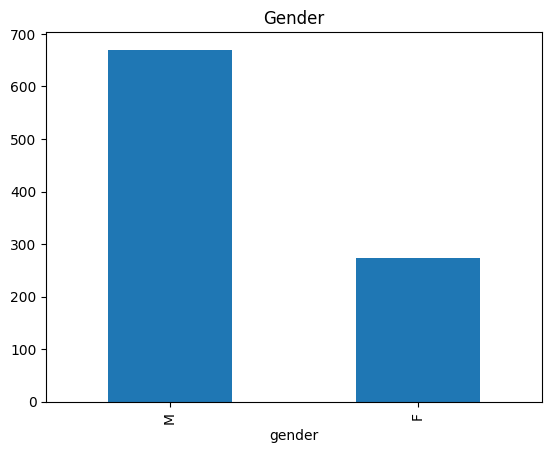
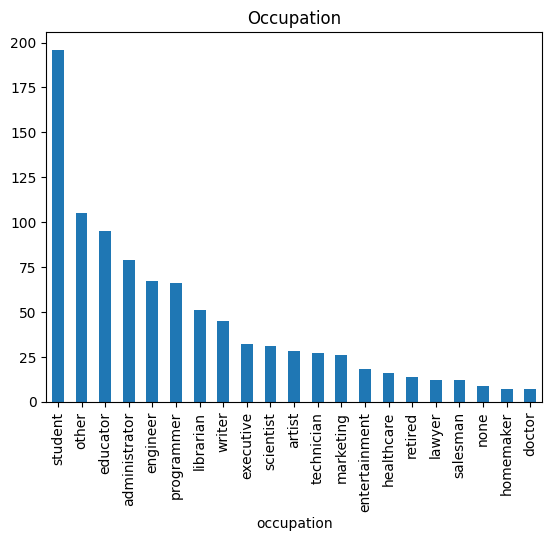

# Final solution

This is report about movie recommendation system I developed. This report
contain information about the 
[data exploration](https://github.com/cutefluffyfox/movie-recommendation/blob/main/notebooks/0.0-dataset-exploration.ipynb), 
[experimenting with graphs](https://github.com/cutefluffyfox/movie-recommendation/blob/main/notebooks/1.0-gcn-lab-modification.ipynb),
[matrix factorization algorithm](https://github.com/cutefluffyfox/movie-recommendation/blob/main/notebooks/2.0-matrix-factorization.ipynb) 
and [classical ML approach](https://github.com/cutefluffyfox/movie-recommendation/blob/main/notebooks/3.0-classical-ml.ipynb) 
for recommendation system. 

This report will also have in-depth information how to run this project, reproduce our 
results and train new models (even on different datasets with nice web interface!).

# Data exploration

As a first step in each problem, we should understand dataset in-depth. The dataset we are using is
[MovieLens 100k Dataset](https://grouplens.org/datasets/movielens/100k/) which contain information 
about ratings user given to films on [MovieLens website](https://movielens.org/). Dataset also contains
information about users (anonymously: age, gender, occupation, zip_code) and about movies 
(genre, title, release_date, video_release_date, url). 

### User distributions

Speaking about users, dataset is biased towards male audience with approximately 3:1 ratio.
.

Most of the users fall into the age range between 20-30, however people with age 30-50 also have
enough data. The main groups that are lacking of examples are <18 and >52. 
.

In discussion of occupation, the dominant group is Students.


And zip-code seems to be almost fully unique with mean value counts of `1.184673366834171`.

### Films distributions

There is not so much interesting information about films, `video_release_date` has no non-null values, 
`title` and `url` if fully unique columns. The only interesting is genre analysis. Due to the fact
that some films could have several genres at once (e.x. `Toy Story (1995) - animation + childrens + comedy`), 
we can mate genre matrix and look at it. From it, we can see that the most popular genres are drama (strong bias towards), 
comedy, romance, action and thriller. Biggest double-genre drama-romance and comedy-romance.


### Ratings distributions

Let's start with the basics by looking at the statistics how many 
rating each film/user received/given.

Speaking about films, maximum number of received ratings is `583`, minimum is `1` with mean around `59`.
Speaking about users, maximum number of given ratings is `737`, minimum is `20` with mean around `106`.

Next observation is the timestamp of ratings. I decided to modify it to month/year to 
see a more human-readable statistics, and surprisingly we can see one month-outlier with
twice as more ratings as expected - November 1997. I can suppose that some popular films 
were published, but I can't say for sure.


Rating distribution shows people more likely to rate a film whether they liked it as ratings more than 2
are significantly dominant in the dataset.


### Combined statistics

And lastly let's look to the combined statistics. One of the idea is to look at the most
popular films. However, 'popular' is ambiguous term, so we used the total number of
ratings given as a feature. With this, we can see that there is only 1 outlier which is
`Star Wars (1977)` with more than 80 more ratings than second movie - `Contact (1997)`.
Image below contains information about only top 15 films.


# Matrix factorization

Now when we understand the dataset we can move on to build some systems. One of the 
approach in building recommendation systems is to try to represent users and items
as meaningful vectors in latent space. For this there exists a lot of matrix decomposition-
based algorithm, but we will stop on one of the simplest - make such latent space, so that
`user_vector • film_vector == rank`.

But how can we make such decomposition? Idea is simple, we can start from random vectors
and then improve their quality by applying gradient descend. We also should define some
loss function and mostly people choose L2 loss with regularization, so that's what we are going
to use.

The main downside of this method is that we are only going to use ranking matrix only,
meaning no additional information about users/movies is going to be used. This makes good
personalized ranking (if converged of course), however it cannot learn trends in general
as there is no generalization technique. Also, if we have no information about user, model
will also perform badly dut to its nature of requiring a lot of data.

Nevertheless, this approach is still pretty good and with fine-tuned parameters I got:
``` 
RMSE: 0.9560474839678743
MAE:  0.752860271542026
```

To reproduce such results you can run `ui.py` python file (from your IDE or console, doesn't matter),
and then open `Matrix factorization` tab where you can choose dataset (we used ml-100k), 
set split size (used 0.8), seed (used 42) and then split and generate rank matrix. To train
and test model, you can select custom parameters, or just use default (as that's the one 
we found the best in this task). Training process will take about 1-2 minutes (if 40 epoch is used) 
and all evaluation info will be shown right after the training.


By using some [benchmark metrics](https://paperswithcode.com/sota/collaborative-filtering-on-movielens-100k) 
for this given dataset we can say that we got pretty close to 2016 state-of-the art model.

# Classical ML on features

Out of curiosity we wanted to see how good inverse model will perform (by using only 
user/movies features, and not 'graph' architecture). With this idea in mind we made second
preprocessing technique for dataset, that instead of creating ranking matrix, it combines 
features and makes feature table with all information described in the [first block](#data-exploration).

The main downside to this approach is almost reverse of matrix factorization, as it provides
good generalization over several users, however it perform poorly on personalized-ranking.

As preprocessing technique we dropped `'user_id', 'item_id', 'video_release_date', 'url', 'timestamp'`
columns, one-hot-encoded all categorical features and scaled numerical. With this dataset 
we trained and evaluated `SGDRegressor`, `LinearRegression`, 
`BayesianRidge` and `CatBoostRegressor` models with 5-fold cross-validation.
Almost all models seems to perform identically, however `BayesianRidge` showed a bit
better results then other on `RMSE`, so we decided to fine-tune it further.

After fine-tuning (all default parameters in GUI interface) we got final metrics as shown
lower, which is almost identical to matrix factorization approach (but MAE is lowe on 0.1).
```
RMSE: 0.9511355671476752
MAE:  0.6422905344111884
```

Such metric shows that we got almost the same results as in 2016, which is good enough.

To reproduce results run `ui.py` script, open `Classical ML on features` tab and chose
all parameters. Default one - the fine-tuned, don't forget to set random seed to `42` (if you want to reproduce).


# Metrics 

Worth mentioning why we used `RMSE` and `MAE` metrics to evaluate the model. First of
there exists some checkpoint on state-of-the-art models for such metrics, so it's good to
compare to understand how good model performs. In addition, these metrics are easy to 
calculate, so that's also was the reason.

# Credits
Created by Polina Zelenskaya\
Innopolis University DS21-03

Github: [@cutefluffyfox](https://github.com/cutefluffyfox)\
Email: p.zelenskaya@innopolis.university
